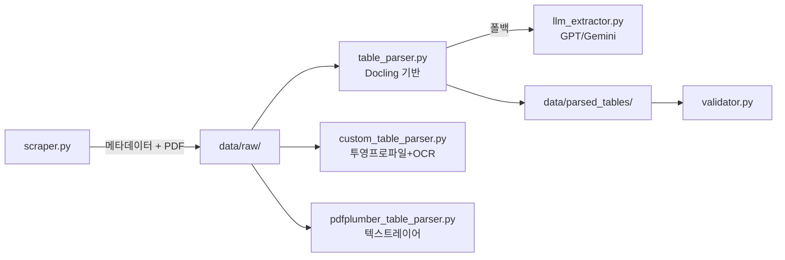
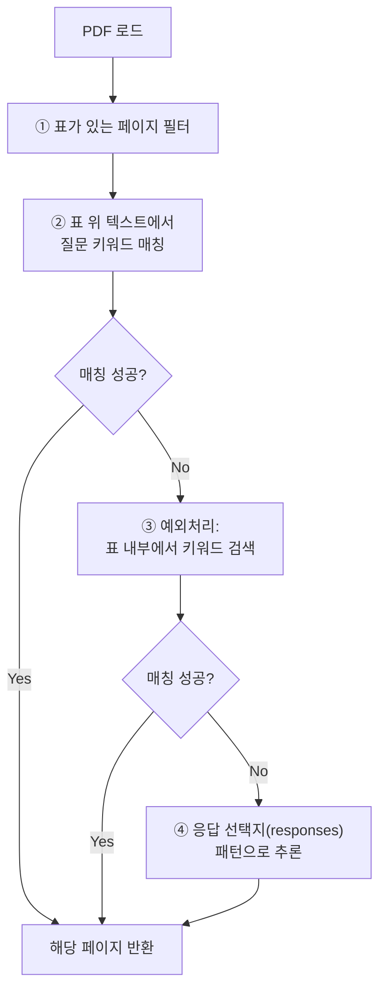

# NESDC 여론조사 파서 업그레이드 & 페이지 선정 기능

**최종 수정**: 2026-02-21 15:47

## 현황 요약



기존 `parsed_tables/` 데이터는 모두 테스트 단계이므로 유지하지 않음.

---

## Phase 1: 데이터 구조 표준화

### 표준 JSON 스키마

#### [NEW] [schema.py](file:///d:/working/nesdc-scraper/nesdc-scraper/schema.py)

```json
{
    "poll_id": "15380",
    "page": [12, 13],
    "keyword": "정당지지도",
    "question": "Q3. 선생님께서는 현재 어느 정당을 지지하십니까?",
    "method": "pdfplumber_v1.0",
    "columns": ["더불어민주당", "국민의힘", "조국혁신당", "..."],
    "data": [
        {
            "group": "전체",
            "category": "전체",
            "n": 1000,
            "n_raw": 1000,
            "n_weighted": 1000,
            "responses": {
                "더불어민주당": 45.6,
                "국민의힘": 33.6,
                "조국혁신당": 4.1
            }
        },
        {
            "group": "성별",
            "category": "남성",
            "n_raw": 577,
            "n_weighted": 532,
            "responses": {
                "더불어민주당": 45.6,
                "국민의힘": 35.0,
                "조국혁신당": 4.0
            }
        }
    ]
}
```

| 필드 | 설명 | 비고 |
|------|------|------|
| `poll_id` | 여심위 nttId | 메타데이터 연결 키 |
| `page` | 원본 PDF 페이지 | 단일 or 병합시 리스트 |
| **`keyword`** | 수집 명령 키워드 | "정당지지도", "국정운영평가" 등 |
| **`question`** | 문항 텍스트 전문 | 표 위 텍스트에서 추출 |
| **`method`** | 파서명 + 버전 | `"pdfplumber_v1.0"`, `"docling_v2.1"` 등 |
| `columns` | 응답 선택지 목록 | 모든 행에 동일한 컬럼 |
| `data[].group` | 인구통계 그룹 | "성별", "연령", "권역" 등 |
| `data[].category` | 세부 항목 | "남성", "30대", "서울" 등 |
| `data[].responses` | 응답 비율(%) | 모든 행이 동일한 키 보유 |

> [!NOTE]
> `columns`는 모든 행의 `responses` 키와 동일합니다. 별도로 두는 이유는 빠른 조회와 스키마 참조용입니다.

기능:
- `infer_group(category)` : 카테고리명 → 그룹 자동 추론 ("남성"→"성별", "30대"→"연령")
- `convert_flat_to_standard()` : 기존 flat 테이블 → 표준 스키마 변환
- `validate_schema()` : 스키마 준수 검증

#### [MODIFY] [validator.py](file:///d:/working/nesdc-scraper/nesdc-scraper/validator.py)

새 스키마의 `responses` dict 기반 행 합계 검증으로 변경

---

## Phase 2: 파서 개선 및 비교 테스트

> [!IMPORTANT]
> 파서 우선순위는 미리 정하지 않고, **실제 데이터 대상 비교 테스트** 후 결정합니다. pdfplumber는 복잡한 표나 조사회사 편집프로그램 특성에 따라 텍스트 위치/순서 인식 문제가 있을 수 있습니다.

### Step 2.1: pdfplumber 파서 범용화

#### [MODIFY] [pdfplumber_table_parser.py](file:///d:/working/nesdc-scraper/nesdc-scraper/pdfplumber_table_parser.py)

**목표**: 하드코딩 제거 및 table_parser.py와 동일한 인터페이스 구현

**작업 내용**:
1. **함수 구조 표준화** (table_parser.py 참고)
   ```python
   get_target_pdf(dir_path)           # 공통 유틸 함수
   parse_survey_table(folder_name, page_numbers, force_llm=False)  # 메인 함수
   ```

2. **하드코딩 제거**
   - ❌ `PDF_PATH = "...15380..."`
   - ✅ `base_dir + folder_name` 동적 경로 생성
   - ❌ `page_num=12`
   - ✅ `page_numbers` 파라미터로 다중 페이지 처리
   - ❌ 고정된 컬럼명 (8개 값 패턴)
   - ✅ 동적 컬럼 감지 및 헤더 추출 로직

3. **표준 스키마 출력**
   ```python
   # 현재: CSV + 평면 JSON
   df.to_csv(...), df.to_json(...)

   # 수정 후: 표준 스키마 JSON
   {
       "poll_id": folder_name,
       "page": page_num,
       "question": extracted_question,  # 페이지 상단에서 추출
       "method": "pdfplumber_v1.0",
       "columns": [...],
       "data": [
           {
               "group": inferred_group,
               "category": label,
               "n_raw": sample_n,
               "n_weighted": weighted_n,
               "responses": {...}
           }
       ]
   }
   ```

4. **커맨드라인 인터페이스**
   ```bash
   python pdfplumber_table_parser.py --folder 15380 --pages 12 13
   ```

5. **Validation 통합**
   - `from validator import validate_table`
   - 파싱 결과 검증 및 품질 점수 출력
   - 낮은 품질 시 경고 (fallback 로직은 Step 2.3에서 추가)

**결과물**:
- `data/parsed_tables/{folder_name}_pdfplumber.json` (표준 스키마)

---

### Step 2.2: Docling 파서 표준 스키마 출력

#### [MODIFY] [table_parser.py](file:///d:/working/nesdc-scraper/nesdc-scraper/table_parser.py)

**목표**: 현재 출력을 표준 스키마로 변환

**작업 내용**:
1. **스키마 변환 로직 추가**
   - 현재: `{"page": p, "data": [...], "columns": [...], "method": "llm_openai"}`
   - 수정: `schema.py`의 표준 구조 사용
   - `question` 필드: markdown에서 추출 또는 빈 문자열
   - `poll_id`: `folder_name` 사용
   - `data[].group`: `schema.infer_group(category)` 활용

2. **출력 파일명 변경**
   - 현재: `{folder_name}_tables.json`
   - 수정: `{folder_name}_docling.json` (파서 구분)

**결과물**:
- `data/parsed_tables/{folder_name}_docling.json` (표준 스키마)

---

### Step 2.3: 파서 비교 테스트

#### [NEW] [test_parser_comparison.py](file:///d:/working/nesdc-scraper/nesdc-scraper/test_parser_comparison.py)

**목표**: 동일 PDF를 모든 파서로 파싱하여 정확도 비교

**작업 내용**:
1. **테스트 데이터 선정**
   - 조사회사별 대표 보고서 5~10건 선정
   - 다양한 표 형식 포함 (단순/복잡, 단일/다중 페이지)

2. **비교 지표**
   ```python
   {
       "poll_id": "15380",
       "page": 12,
       "parsers": {
           "docling": {
               "success": True,
               "row_count": 15,
               "column_accuracy": 0.95,  # 컬럼명 정확도
               "value_accuracy": 0.92,   # 값 정확도
               "validity_score": 85.0,
               "processing_time": 3.2
           },
           "pdfplumber": {...}
       }
   }
   ```

3. **실행 방식**
   ```bash
   python test_parser_comparison.py --test-set benchmark_polls.json
   ```

4. **결과 리포트**
   - Markdown 표로 파서별 성능 비교
   - 조사회사별 최적 파서 추천
   - 실패 케이스 분석

**결과물**:
- `reports/parser_comparison_report.md`
- `data/benchmark_results.json`

---

### Step 2.4: 파서 선택기 구현

#### [NEW] [parser_selector.py](file:///d:/working/nesdc-scraper/nesdc-scraper/parser_selector.py)

**목표**: PDF 특성 분석 후 최적 파서 선택 + 폴백 체인

**작업 내용**:
1. **PDF 분석 함수**
   ```python
   def analyze_pdf(pdf_path, page_num):
       return {
           "has_text_layer": bool,
           "table_complexity": "simple" | "complex",
           "estimated_columns": int,
           "text_layout_quality": float  # 텍스트 위치 규칙성
       }
   ```

2. **파서 선택 로직** (비교 테스트 결과 기반)
   ```python
   def select_parser(pdf_analysis, company_id=None):
       if pdf_analysis["has_text_layer"] and pdf_analysis["text_layout_quality"] > 0.8:
           return ["pdfplumber", "docling", "llm"]
       else:
           return ["docling", "llm"]
   ```

3. **폴백 체인 실행**
   ```python
   def parse_with_fallback(folder_name, page_numbers):
       parsers = select_parser(analyze_pdf(...))
       for parser in parsers:
           result = execute_parser(parser, ...)
           if validate_table(result) > threshold:
               return result
       return None  # 모든 파서 실패
   ```

**결과물**:
- 자동 파서 선택 및 폴백 처리 모듈

---

## Phase 3: 페이지 선정 기능

#### [NEW] [page_finder.py](file:///d:/working/nesdc-scraper/nesdc-scraper/page_finder.py)

### 탐색 로직 (우선순위 순)



### 질문 키워드 정의

| 수집항목 | 키워드 목록 | 비고 |
|----------|------------|------|
| **정당지지도** | `정당`, `지지`, `가깝` | |
| **국정운영평가** | `대통령`, `잘하고`, `평가`, `운영`, `국정` | |
| **후보지지도** | `{직위명}` + `지지`, `선호`, `낫다고`, `투표` | 직위명: 서울시장, 경기도지사 등 메타데이터에서 추출 |

### 예외 처리

- **질문이 표 안에 포함된 경우**: 표 첫 행이나 병합 셀에 질문 텍스트가 들어간 경우 → 표 내부 텍스트에서도 키워드 검색
- **응답 패턴 기반 추론**: 키워드 매칭 실패 시, responses 컬럼명 패턴으로 유형 추론 (정당명 포함 → 정당지지도)

---

## Verification Plan

### 자동 테스트

```bash
python -m pytest tests/test_schema.py -v          # 스키마 변환
python test_parser_comparison.py                   # 파서 비교
python -m pytest tests/test_page_finder.py -v      # 페이지 선정
```

### 수동 검증

- 조사회사별 대표 보고서로 파싱 → 원본 PDF와 육안 대조
- 키워드로 페이지 탐색 → 실제 통계표 위치와 일치 확인
